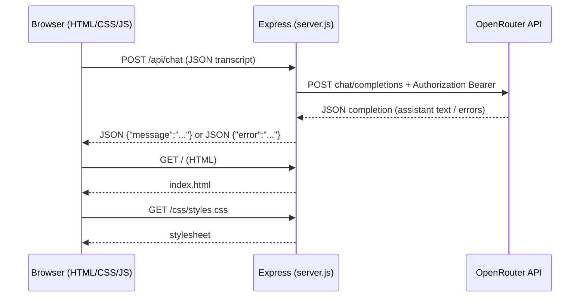

# Building a Local Portfolio Website with Express.js and an AI “Digital Twin” Chat

This tutorial explains the project in this repo in plain language: what each technology does, how the pieces fit together, and how the important code paths work.

It assumes you have **never written a website before**, but you *can*:

- Install software on your computer
- Open a terminal (macOS Terminal, Windows Terminal, VS Code terminal, etc.)
- Edit files in an editor such as Cursor or VS Code

---

## Table of contents

1. [What You Built (In One Paragraph)](#1-what-you-built-in-one-paragraph)
2. [Technology Summary (Plain English)](#2-technology-summary-plain-english)
3. [Important Concepts Before Code](#3-important-concepts-before-code)
4. [Project Folder Map](#4-project-folder-map)
5. [How to Run the Project Locally](#5-how-to-run-the-project-locally)
6. [High-Level Architecture Walkthrough](#6-high-level-architecture-walkthrough)
7. [Detailed Code Review (Frontend)](#7-detailed-code-review-frontend)
8. [Detailed Code Review (Backend)](#8-detailed-code-review-backend)
9. [Two Real Bugs You Hit (So You Understand “Debugging”)](#9-two-real-bugs-you-hit-so-you-understand-debugging)
10. [Five Improvement Ideas (Self Review)](#10-five-improvement-ideas-self-review)

---

## 1. What you built (in one paragraph)

You built a **local website** served by **Node.js + Express**:

- Visitors see your **marketing-style portfolio page** (`public/index.html` + styling + animations).
- You also built a **chat widget** in the browser that sends messages to your server at **`POST /api/chat`**.
- Your Express server secretly calls **OpenRouter** (an AI API gateway), using **`OPENROUTER_API_KEY`** from your **`.env` file**.
- OpenRouter replies with assistant text and your Express server returns **`{ "message": "..." }`** to the browser in **JSON**.
- Important security detail: the **browser never sees your API key**.

---

## 2. Technology summary (plain English)

| Tech | Role in this repo |
|------|-------------------|
| **HTML** (`public/index.html`) | The structure of your page (headings, sections, footer, chat panel). |
| **CSS** (`public/css/styles.css`) | Controls layout, typography, spacing, gradients, responsiveness. |
| **JavaScript (“frontend JS”)** | Runs inside the visitor’s browser. Here it powers scroll animations (`public/js/main.js`) and chat UI (`public/js/chat.js`). |
| **HTTP** | The protocol browsers and servers use to talk. Typical examples: **`GET`** (fetch a page/asset) and **`POST`** (send data such as chat messages). |
| **Fetch API** (`fetch(...)`) | A browser function that makes HTTP requests. Your chat uses **`fetch`** to POST JSON to **`/api/chat`**. |
| **JSON** | A simple text format for structured data (`{ "key": "value" }`). |
| **Node.js** | A JavaScript runtime on your machine that can run a server (`node server.js`). |
| **Express.js** (`server.js`) | A lightweight web framework that routes URLs (like **`/`** or **`/api/chat`**) and sends responses (HTML/CSS/JS files or JSON). |
| **`npm`** | Common tool for downloading JavaScript dependencies listed in **`package.json`**. |
| **`dotenv`** | Loads **`OPENROUTER_API_KEY`** (and **`PORT`** if you set one) from a **`.env`** file into `process.env` at startup. |
| **OpenRouter** | A service that lets you pick from many AI models using an OpenAI-style API endpoint. |
| **Environment variables (`process.env`)** | Secret configuration your server reads at runtime. Your key lives in `.env` and is **ignored by git**. |

---

## 3. Important concepts before code

### 3.1 “Frontend vs backend”

- **Frontend**: code that runs **in the user’s browser** (HTML/CSS/JS in `public/`).
- **Backend**: code that runs **on your server** (mostly `server.js` here).

The chat is intentionally split this way:

- The browser asks your backend: **“please answer using my career facts.”**
- Your backend speaks to OpenRouter using the secret key.

### 3.2 Why we do not embed the AI key in the browser

Anything in frontend JavaScript becomes **public**:

- Visitors can inspect it (“View Page Source”).
- Attackers could steal your credits / abuse your key.

Therefore: **frontend calls your server**, and **only your server** calls OpenRouter.

### 3.3 Routes (URLs your server recognizes)

Examples in this repo:

| Method + path | Meaning |
|---|---|
| **`GET /`** | Send the homepage HTML file. |
| **`GET /css/styles.css`** | Static file downloaded by browser. |
| **`GET /api/health`** | Simple JSON “is the backend alive?” check. |
| **`POST /api/chat`** | Submit chat transcript to your server → OpenRouter. |

---

## 4. Project folder map

This is the conceptual map beginners find helpful:

```
site_udemy/
├── package.json            # Scripts + dependency list ("express", "dotenv")
├── package-lock.json       # Locks exact downloaded versions for reproduc installs
├── server.js               # Express backend (routing + AI proxy logic)
├── .env                    # LOCAL secrets/config (never commit)
├── Profile.pdf             # Source material used to write portfolio text
├── public/                 # Public website files Express can serve directly
│   ├── index.html
│   ├── css/styles.css
│   └── js/
│       ├── main.js         # Scroll reveal animations
│       └── chat.js         # Chat UI + POST /api/chat
└── tutorial.md             # You are reading this file
```

---

## 5. How to run the project locally

1. Install dependencies (once):

```bash
cd site_udemy
npm install
```

2. Configure secrets (local only):

Create (or verify) `.env` includes:

```
OPENROUTER_API_KEY=paste-your-key-here
```

Optional:

```
PORT=3001
SITE_URL=http://localhost:3001
```

3. Start the server:

```bash
npm start
```

4. Open the site URL printed in your terminal logs (example):

- `http://localhost:3001`

5. Sanity check the API endpoint:

Visit:

- `http://localhost:3001/api/health`

You should see JSON like:

```json
{ "ok": true, "chat": true, "endpoint": "/api/chat" }
```

If **`/api/health` fails** but CSS loads fine, you are probably not hitting this Express server (very common beginner pitfall described later).

---

## 6. High-level architecture walkthrough

### 6.1 Big picture diagram



### 6.2 What happens step-by-step when you chat

1. You type text and click **Send** (`public/js/chat.js`).
2. The browser adds `{ role: "user", content: "your text" }` to an array called **`conversation`**.
3. The browser **`fetch`es `POST /api/chat`** with:

```json
{ "messages": [ /* user/assistant history */ ] }
```

4. `server.js`:
   - reads `OPENROUTER_API_KEY`
   - **sanitizes** messages (`sanitizeMessages(...)`)
   - prepends a **system prompt** (`DIGITAL_TWIN_SYSTEM`)
   - calls OpenRouter
   - returns `{ "message": "..." }` on success.

5. The browser renders the assistant text as a bubble in the UI.

---

## 7. Detailed code review (frontend)

### 7.1 `public/index.html` — structure & linking assets

Conceptually HTML is a tree:

- `<head>`: metadata + links to CSS fonts/styles.
- `<body>`: visible content such as navbar, hero, sections, footer, chat UI.
- Scripts load at bottom so DOM elements exist when JS runs:

```html
<script src="/js/main.js"></script>
<script src="/js/chat.js"></script>
```

**Why two JS files**: separation keeps concerns understandable:

- `main.js`: visual polish unrelated to networking.
- `chat.js`: network + conversational UI logic.

Beginner takeaway: **`index.html` is not “logic.”** Mostly structure + attaching resources.

---

### 7.2 `public/css/styles.css` — visuals (high level)

This file defines variables like **`--blue`**, **`--muted`**, and layout rules like grids and flex positioning.

Important beginner note for your chat UI:

The chat overlay uses rules like **`position: fixed`** and a high **`z-index`** so it floats above normal page scrolling.

Reading CSS is slower than JS for beginners—that is normal—focus conceptually:

- **layout** (`display: grid/flex`)
- **spacing** (`margin`, `padding`)
- **type** (`font-family`, weights)
- **colors** (`background`, `color`, gradients)

---

### 7.3 `public/js/main.js` — “reveal sections” animations

Concept: **IntersectionObserver** watches sections with class **`reveal`**. When a section enters the viewport, JS adds **`show`** to trigger CSS transitions.

Starter-style teaching sample (simplified for clarity):

```javascript
const observer = new IntersectionObserver(
  (entries) => {
    entries.forEach((entry) => {
      if (entry.isIntersecting) {
        entry.target.classList.add("show");
      }
    });
  },
  { threshold: 0.15 }
);

document.querySelectorAll(".reveal").forEach((element) => {
  observer.observe(element);
});
```

**Beginner glossary**

- `document.querySelectorAll(...)`: selects many elements from HTML.
- `classList.add("show")`: toggles styling without rewriting HTML.

---

### 7.4 `public/js/chat.js` — building UI bubbles + POSTing transcripts

Conceptually chat code does five jobs:

1. **Wire up buttons/forms** (“open chat”, submit message).
2. **Keep transcript** in JS memory (`conversation` array).
3. **Paint UI** bubbles using `document.createElement` (safe escaping via `textContent`).
4. **Call your backend with `fetch`** (`postChat`).
5. **Interpret JSON/errors** gracefully.

Teaching sample (“send message”), simplified but mirrors the repo idea:

```javascript
conversation.push({ role: "user", content: text });
appendBubble("user", text);

const { res, raw } = await postChat(conversation);

const data = raw ? JSON.parse(raw) : {};
if (!res.ok) {
  // show readable error bubble
}

conversation.push({ role: "assistant", content: data.message });
appendBubble("assistant", data.message);
```

Two practical features worth understanding as a learner:

#### A) Handling “Cannot POST `/api/chat`” failures

Sometimes beginners open **`index.html`** with a preview server that serves static files **without Express routes**.
That yields HTML like **“Cannot POST /api/chat”**.

The helper `postChat`:

- tries the same-origin `/api/chat` first (so if Express runs on **`:3001`**, browsing **`http://localhost:3001`** automatically targets **`http://localhost:3001/api/chat`**),
- may retry **`http://localhost:3000/...`**-style URLs as a pragmatic dev workaround when HTML is hosted on another local preview port (`file://`/Live Server quirks),
- detects that HTML-shaped failure with `isCannotPostHtml(...)`.

Teaching moment: **`fetch("/api/chat")` is relative to whichever host opened the HTML**. If HTML is hosted on `:5500`, the fetch targets `:5500` unless overridden.

Optional override hook:

```javascript
window.__CHAT_API__ = "http://localhost:YOUR_PORT/api/chat";
```

Place that before `chat.js` loads.

#### B) Parsing errors safely (`readErrorFromBody`)

APIs disagree on shapes. Your backend usually returns **`{ error: "string"}`**, but other systems nest errors like **`{ error: { message: "..." } }`**.

`readErrorFromBody` checks multiple possibilities so the bubble text is actionable.

---

## 8. Detailed code review (backend)

File: **`server.js`**

### 8.1 Load configuration from `.env` (`dotenv`)

```javascript
require("dotenv").config();

const PORT = process.env.PORT || 3001;
```

**Beginner meaning**

- `require("dotenv").config()` runs early so `process.env.OPENROUTER_API_KEY` exists.
- **`PORT`** is how you serve on `:3001` vs `:3000`.

---

### 8.2 Create Express + define constants

Short teaching snippet:

```javascript
const express = require("express");
const app = express();

const OPENROUTER_URL = "https://openrouter.ai/api/v1/chat/completions";
const CHAT_MODEL = "openai/gpt-oss-120b:free";
```

`CHAT_MODEL` is the identifier OpenRouter understands for the model tier you chose.

---

### 8.3 `DIGITAL_TWIN_SYSTEM`: “instructions + facts” merged into AI context

Concept: In chat APIs, **`role: "system"`** is special guidance describing how the assistant should behave.

Here you baked in:

- Facts from your **`Profile.pdf`**
- “Answer only from these facts.”
- “If unknown, defer to email/LinkedIn.”

Beginner takeaway: this is NOT “truth enforcement,” but it massively reduces hallucination risk for a toy portfolio demo.

Implementation shape (conceptual):

```javascript
const openRouterMessages = [
  { role: "system", content: DIGITAL_TWIN_SYSTEM },
  ...messagesFromBrowser,
];
```

---

### 8.4 `sanitizeMessages` — basic server-side validation

Purpose:

- rejects nonsense (`messages` missing, wrong shape)
- only allows **`user`** + **`assistant`**
- prevents absurdly huge strings

Beginner takeaway: Never trust frontend input—even on a hobby project.

Starter pattern:

```javascript
function sanitizeMessages(raw) {
  if (!Array.isArray(raw)) return null;
  // ... iterate, validate roles, truncate ...
  return out.length ? out : null;
}
```

---

### 8.5 `callOpenRouter` — the actual AI network call (+ retries)

Key ideas:

#### A) Secrets are injected as Bearer token

```javascript
Authorization: `Bearer ${apiKey.trim()}`
```

#### B) OpenRouter attribution headers (`HTTP-Referer`, titles)

Used for OpenRouter leaderboard/app attribution docs.

Important bug you encountered (worth teaching):

HTTP headers generally must use **ASCII** values compatible with **`ByteString`**. Decorative Unicode punctuation in header values caused Node fetch to throw (`—` vs `-`).

The fix principle: **`X-Title` must be ASCII-safe**.

#### C) Rate limits (`429`)

Free models can throttle. Basic retry backoff:

```javascript
if (upstream.status === 429 && attempt < maxAttempts - 1) {
  await sleep(retryAfterMs);
  attempt += 1;
  continue;
}
```

---

### 8.6 `extractAssistantReply` — normalize differing model outputs

Different providers/models can return subtly different JSON shapes:

- message content might be **`string`** *or* an **array** of parts
- some responses might include errors inside **`choices[0].error`** even when HTTP succeeds

Teaching purpose: **`extractAssistantReply`** hides that complexity behind:

- **`{ kind: "ok", text }`**
- **`{ kind: "error", message }`**
- **`{ kind: "empty" }`**

---

### 8.7 `POST /api/chat` — orchestration glue

Flow:

```javascript
app.post("/api/chat", async (req, res) => {
  // 1) require API key configured
  // 2) sanitize messages from req.body.messages
  // 3) build openRouterMessages = system + user history
  // 4) callOpenRouter(...)
  // 5) translate upstream failures into readable JSON errors
  // 6) return JSON { message: "..." }
});
```

**HTTP status intuition for beginners**:

- **`400`**: caller sent malformed input (“bad chat payload”).
- **`502`**: upstream AI failed (“bad gateway” pattern).
- **`503`**: your server lacks configuration (missing `.env` key).

---

### 8.8 Route ordering matters (important Express lesson)

In this repo, API routes (`GET /api/health`, `POST /api/chat`) appear **before** this line:

```javascript
app.use(express.static(path.join(__dirname, "public")));
```

Teaching reason: **`express.static` serves files**.

If confusing routing/order happens, beginners can mistakenly think **`/api/chat` “does not exist.”**

Conceptual best practice demonstrated here:

- define explicit API routes clearly,
- then serve static assets.

---

### 8.9 CORS for local development convenience

Mounted as:

```javascript
app.use("/api", apiCors);
```

This allows **`fetch`** from alternate dev hosts (think “Live Server”) to call **`http://localhost:YOUR_PORT`** during development.

**Production warning**: permissive **`Access-Control-Allow-Origin: *`** on authenticated/paid inference routes can be undesirable; tighten later.

---

## 9. Two real bugs you hit (so you understand “Debugging”)

### Bug A) `Cannot POST /api/chat`

**Symptom**: HTML error bubble from Express saying “Cannot POST /api/chat”.
**Interpretation**: the HTTP server answering that host/port did not register **`POST /api/chat`**.

Typical beginner causes:

- opened HTML via a preview server that serves only static assets,
- stale Node process,

**Fix mentality**: validate **`GET /api/health`** on the intended port.

---

### Bug B) `ByteString` header error (`8212`)

**Symptom**: server crash/log mentioning **ByteString** and codepoint **8212** (often an “em dash” character).
**Interpretation**: a **Unicode character** leaked into **`fetch`** header values in Node.js.

**Fix principle**: Keep OpenRouter attribution headers **`X-Title` / `X-OpenRouter-Title` ASCII-only.**

---

## 10. Five improvement ideas (self review)

These are purposeful “next lessons” aligned with engineering maturity:

### 1) Tighten CORS + add lightweight abuse protections

Production sites usually replace **`Access-Control-Allow-Origin: *`** with explicit allowed origins (`SITE_URL`).
You can also rate-limit **`POST /api/chat`** per IP/session to reduce accidental cost spikes.

### 2) Add streaming assistant responses (“typewriter UX”)

OpenRouter supports streaming (`stream: true` with SSE chunks).
Frontend streaming is more complex, but UX feels premium.

### 3) Extract server modules (`routes/chat.js`, `lib/openrouter.js`)

`server.js` is readable today, but as features grow (`/api/contact`, analytics, caching), splitting files reduces confusion.

### 4) Add automated smoke tests (`/api/health`, chat route shape)

A tiny automated test catches regressions like “routes accidentally removed” faster than debugging in-browser.

### 5) Persist conversations carefully (privacy + security)

Saving transcripts requires consent, retention policy, GDPR-style considerations, and authentication for private views.
Doing this responsibly is significantly more engineering than anonymous local demos.

---

## Closing advice for beginners

If you memorize only three rules from this project:

1. **Frontend is public.** Never ship API keys there.
2. **`fetch` URLs are interpreted relative to whatever host serves your HTML.** If chat fails weirdly, check **origin + port**.
3. **HTTP routing is explicit.** Confirm **`/api/health`** before blaming “the AI.”

You now have enough mental model to iterate: swap models, tighten styling, publish to a hosting provider, then graduate into frameworks (React/Vite) once you crave component structure.
